# MIPS 8 bit processor

This is the semester-long project for the University of Notre Dame VLSI Design class. 

## Getting Started with Virtuoso

The first step was to get used to the Virtuoso schematic editor. In this case we created a schematic for a 2 input NAND gate and a 3 input NOR gate. Both logic gates were simulated using Spectre to check their behavior.

### 2 input NAND gate
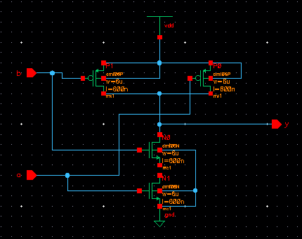
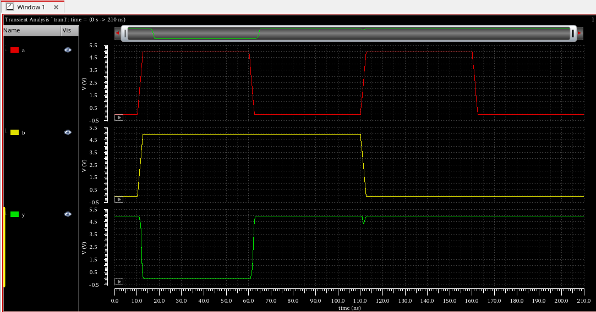

### 3 input NOR gate
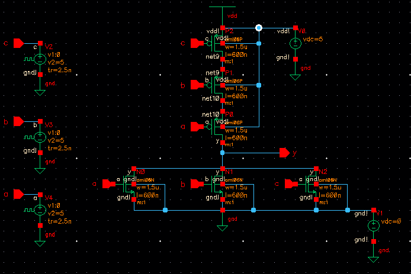
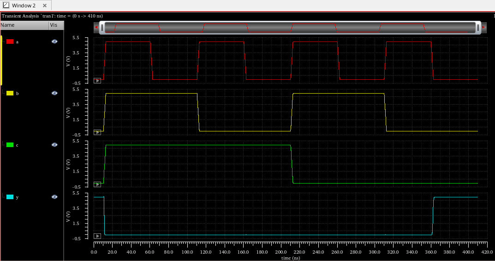

## Layouts: Basic PMOS and NMOS and an inverter cell

To explore the layout tools of Virtuoso we created our own standard cells for an inverter

### NMOS: schematic, symbol and IV curves
| 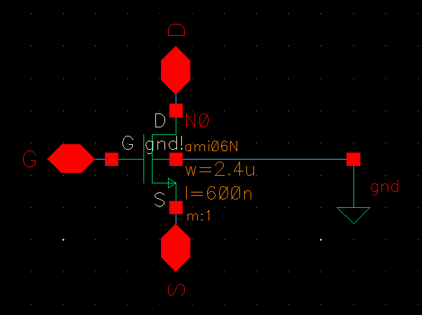 | 
|:--:| 
| *NMOS schematic* |

| 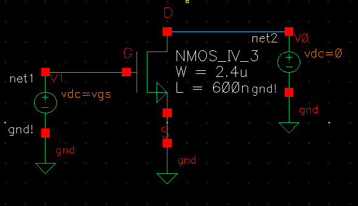 |
|:--:| 
| *NMOS simulation schematic* |

| 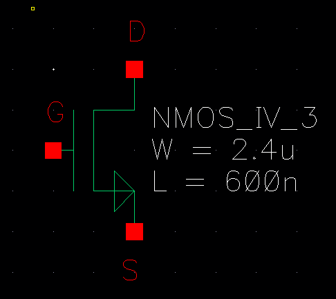 |
|:--:| 
| *NMOS symbol* |

| 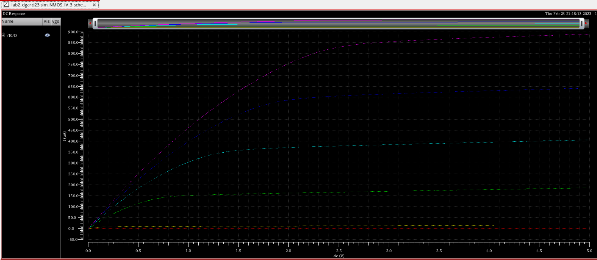 |
|:--:| 
| *NMOS IV Curves* |

### PMOS: schematic, symbol and IV curves
| 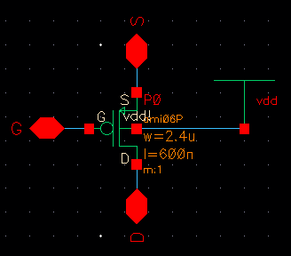 | 
|:--:| 
| *PMOS schematic* |

| 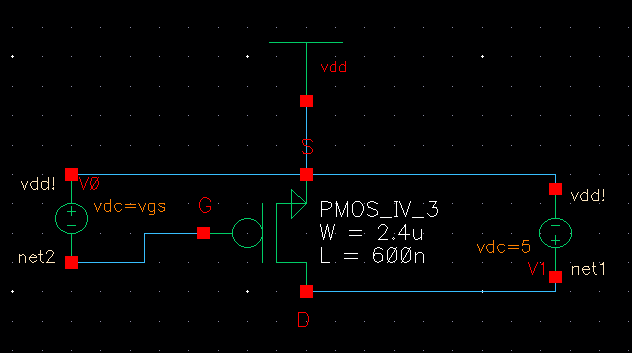 |
|:--:| 
| *PMOS simulation schematic* |

| 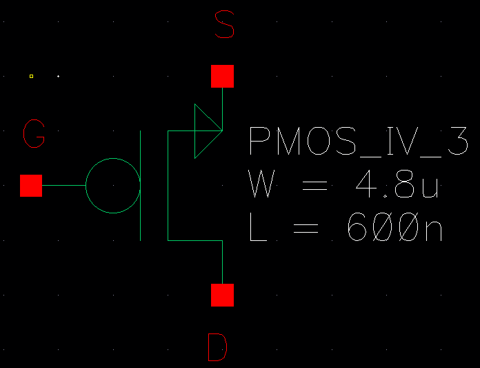 |
|:--:| 
| *PMOS symbol* |

| 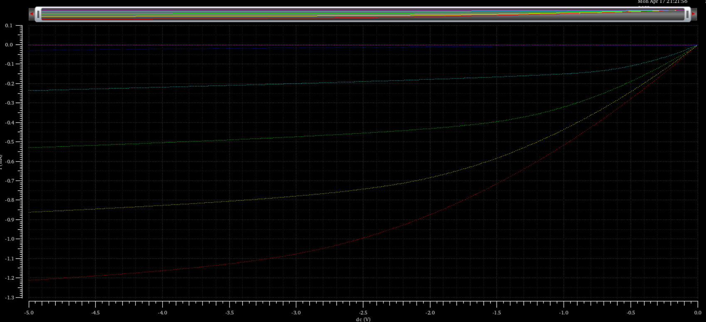 |
|:--:| 
| *PMOS IV Curves* |

### Inverter Cell

| 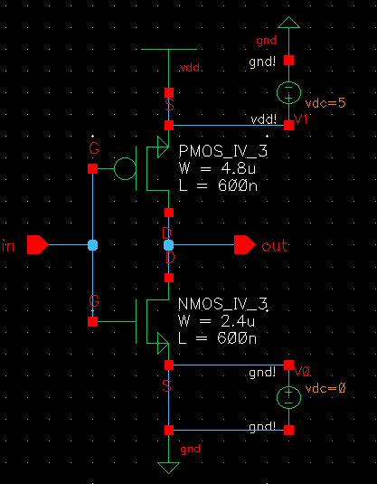 | 
|:--:| 
| *Inverter schematic* |

| 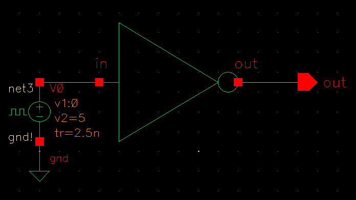 |
|:--:| 
| *Inverter simulation schematic* |

| 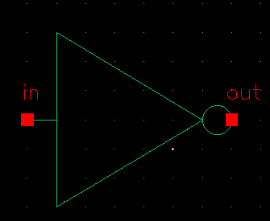 |
|:--:| 
| *Inverter symbol* |

| 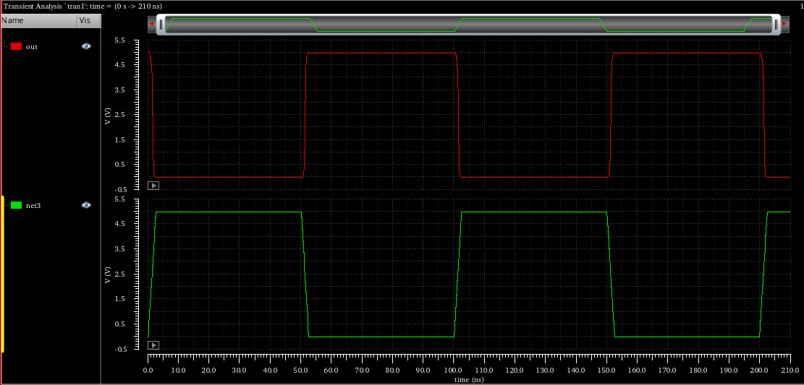 |
|:--:| 
| *Inverter Waveforms* |

| 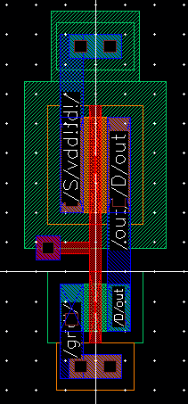 | 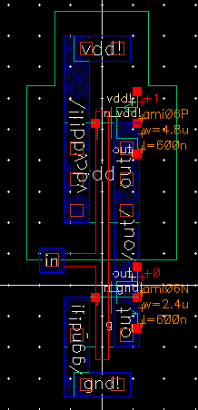 |
|:--:|:--:| 
| *Inverter Layout* | *Inverter Extracted* |

## Layout Next Step: 2 input NAND gate

|  | 
|:--:| 
| *NAND schematic* |

|  |
|:--:| 
| *NAND symbol* |

|  |
|:--:| 
| *NAND Waveforms* |

|  |  |
|:--:|:--:| 
| *NAND Layout* | *NAND Extracted* |

## Advanced Logic layouts

### Part 1 Circuit

| 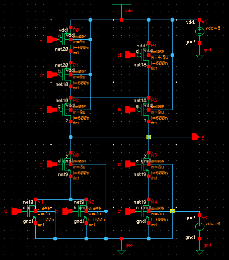 | 
|:--:| 
| *Schematic* |

| 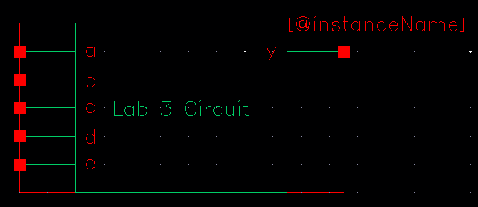 |
|:--:| 
| *Symbol* |

| 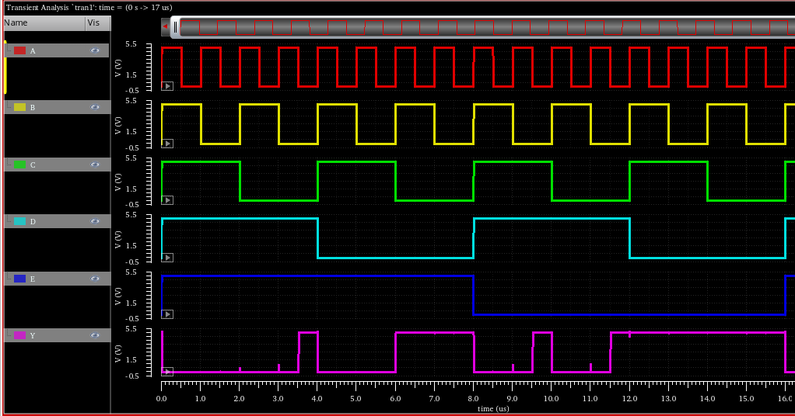 |
|:--:| 
| *Waveforms* |

| 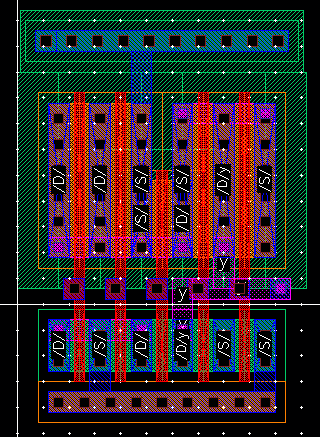 | 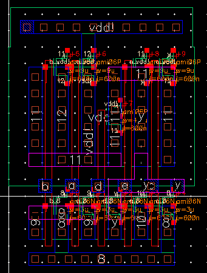 |
|:--:|:--:| 
| *Layout* | *Extracted* |

### Part 2 Circuit

| 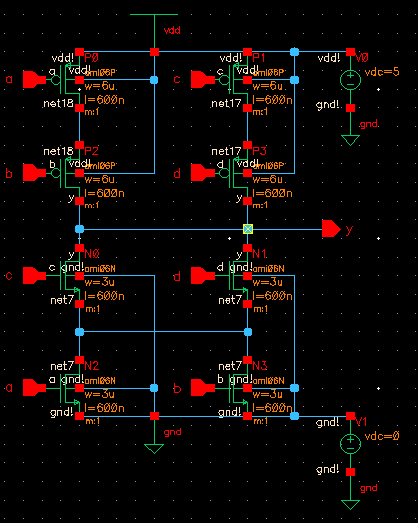 | 
|:--:| 
| *Schematic* |

| 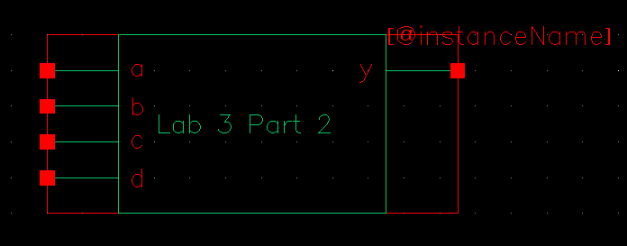 |
|:--:| 
| *Symbol* |

| 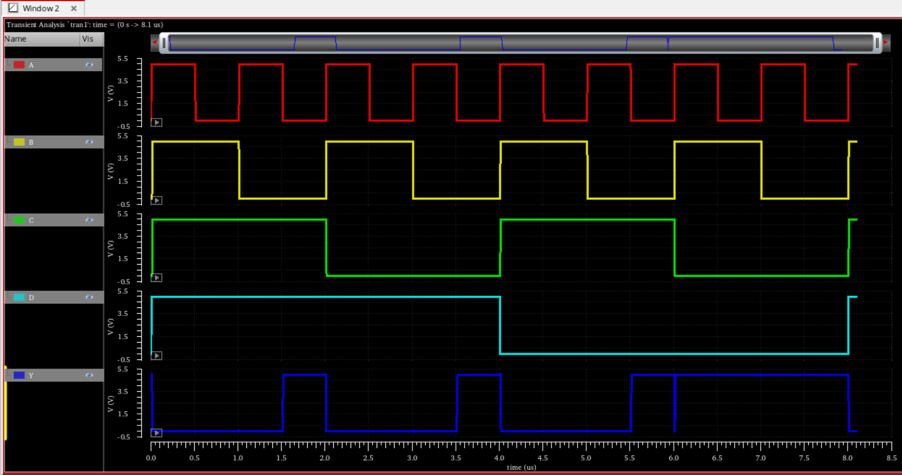 |
|:--:| 
| *Waveforms* |

| 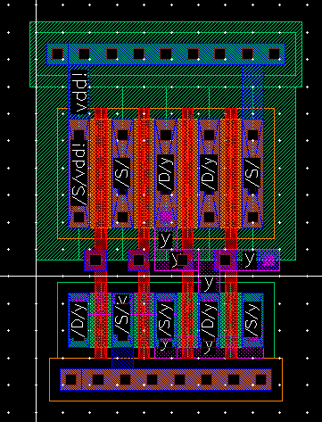 | 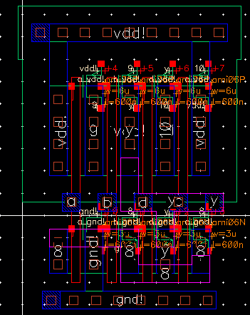 |
|:--:|:--:| 
| *Layout* | *Extracted* |

