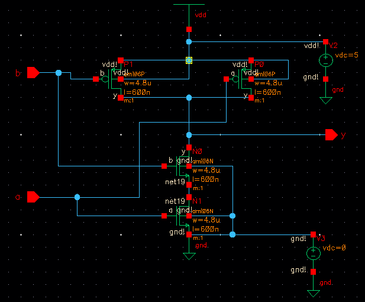
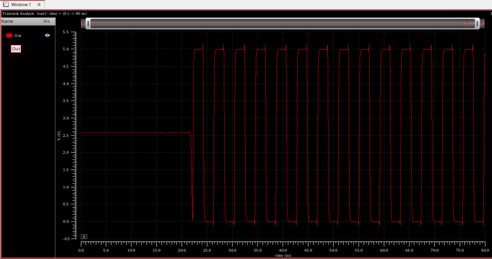
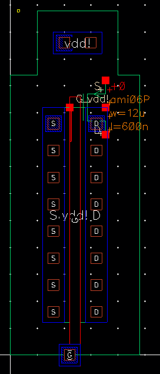
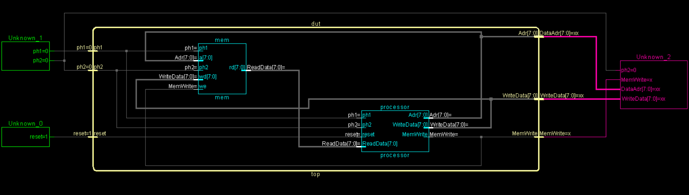
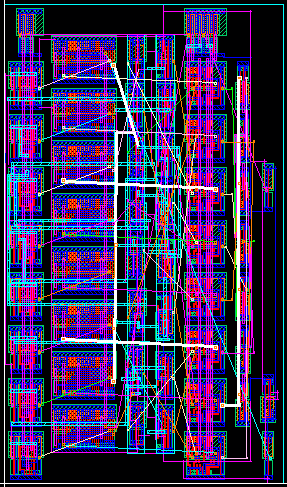
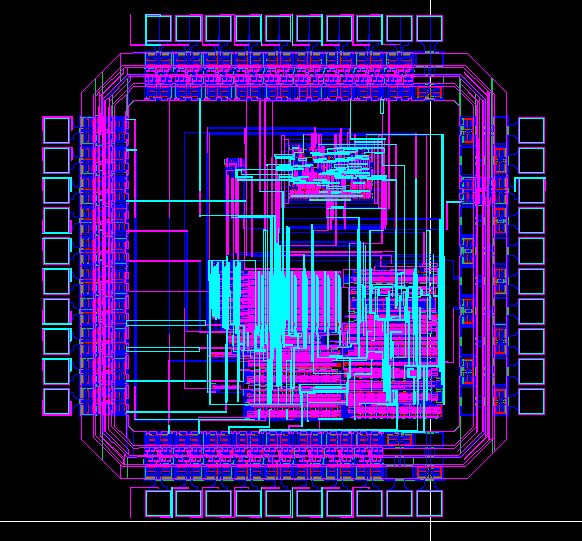

# MIPS 8 bit processor

This is the semester-long project for the University of Notre Dame VLSI Design class. The project starts with some familiarization with the Cadence tools that will be used later in designing an 8 bit MIPS microprocessor. Most steps include the schematic of the design, the symbol, the layout and the extracted view. There are some steps with simulation schematics and waveform results.

## Table of Contents
1. [Getting Started with Virtuoso](#getting-started-with-virtuoso)
2. [Layouts: Basic PMOS and NMOS and an inverter cell](#layouts-basic-pmos-and-nmos-and-an-inverter-cell)
3. [Layout Next Step: 2 input NAND gate](#layout-next-step-2-input-nand-gate)
4. [Advanced Logic layouts](#advanced-logic-layouts)
5. [Creating a Ring Oscillator](#creating-a-ring-oscillator)
6. [Creating a Full Adder](#creating-a-full-adder)
7. [Controller and Dapapath Design](#controller-and-dapapath-design)
8. [Full Chip](#full-chip)

## Getting Started with Virtuoso

The first step was to get used to the Virtuoso schematic editor. In this case we created a schematic for a 2 input NAND gate and a 3 input NOR gate. Both logic gates were simulated using Spectre to check their behavior.

### 2 input NAND gate

The 2 input NAND gate consists of a pull up network made of two NMOS in parallel and a pull down network made of two PMOS in series.

The waveforms for the NAND simulations are below and are consistent with what we expect from a NAND gate.

### 3 input NOR gate

The 2 input NOR gate consists of a pull up network of 3 NMOS in series and a pull down network of 3 PMOS in parallel.

Below are the waveforms for the NOR simulations.

## Layouts: Basic PMOS and NMOS and an inverter cell

To explore the layout tools of Virtuoso we created our own standard cells for an inverter. We will start by simulating the simple NMOS and PMOS cells.

### NMOS: schematic, symbol and IV curves

Below are the schematic, symbol and simulation schematic for the NMOS.

|  |  |  |
|:--:|:--:|:--:| 
| *NMOS schematic* | *NMOS simulation schematic* | *NMOS symbol* |

|  |
|:--:| 
| *NMOS IV Curves* |

### PMOS: schematic, symbol and IV curves

Below are the schematic, symbol and simulation schematic for the PMOS.

|  |  |  |
|:--:|:--:|:--:| 
| *PMOS schematic* | *PMOS simulation schematic* | *PMOS symbol* |

|  |
|:--:| 
| *PMOS IV Curves* |

### Inverter Cell

Now that we have simulated the NMOS and PMOS behavior, we continue with the inverter schematic and simulation.

|  |  |  |
|:--:|:--:|:--:| 
| *Inverter schematic* | *Inverter simulation schematic* | *Inverter symbol* |

|  |
|:--:| 
| *Inverter Waveforms* |

The inverter is the first cell that we will layout manually in Virtuoso.

|  |  |
|:--:|:--:| 
| *Inverter Layout* | *Inverter Extracted* |

## Layout Next Step: 2 input NAND gate

|  | 
|:--:| 
| *NAND schematic* |

|  |
|:--:| 
| *NAND symbol* |

|  |
|:--:| 
| *NAND Waveforms* |

|  |  |
|:--:|:--:| 
| *NAND Layout* | *NAND Extracted* |

## Advanced Logic layouts

These next two circuits and layouts are for two more complex logic functions. Each circuit has the schematic, the symbol, the waveforms, the layout and the extracted view.

### Part 1 Circuit

The logic function for this circuit is:

$y=\overline{(a+b)d+ce}$

|  | 
|:--:| 
| *Schematic* |

|  |
|:--:| 
| *Symbol* |

|  |
|:--:| 
| *Waveforms* |

|  |  |
|:--:|:--:| 
| *Layout* | *Extracted* |

### Part 2 Circuit

The logic function for this circuit is:

$y=\overline{(a+b)(c+d)}$

|  | 
|:--:| 
| *Schematic* |

|  |
|:--:| 
| *Symbol* |

|  |
|:--:| 
| *Waveforms* |

|  |  |
|:--:|:--:| 
| *Layout* | *Extracted* |

## Creating a Ring Oscillator

We then create a ring oscillator using 21 inverters chained in series. We include the schematic for the oscillator, the waveforms showing the oscillating signal and the layout and extracted view for the oscillator.

|  | 
|:--:| 
| *Ring Oscillator Schematic* |

|  | 
|:--:| 
| *Ring Oscillator Waveforms* |

|  | 
|:--:| 
| *Ring Oscillator Layout* |

|  | 
|:--:| 
| *Ring Oscillator Extract* |

## Creating a Full Adder

On this section we will create a Full Adder. We will first start creating a set of standard cells for 2 PMOS and 2 NMOS, with the different sizing needed for the adder. We will then create the schematic for the adder and the symbol. We will also simulate the adder to check the functionality. And then we will use automatic place and route in Virtuoso to finish the layout and extracted view for the adder.

### PMOS and NMOS cells

| PMOS 81 | PMOS 11 | NMOS 41 | NMOS 11 |
|:--:|:--:|:--:|:--:| 
|  |  |  |  |
|  |  |  |  | 
|  |  |  |  |
|  |  |  |  |

### Putting it all together

This is the schematic, symbol, waveforms, layout and extracted view for the adder.

|  | 
|:--:| 
| *Full Adder Schematic* |

|  | 
|:--:| 
| *Full Adder Symbol Waveforms* |

|  | 
|:--:| 
| *Full Adder Simulation Schematic* |

|  | 
|:--:| 
| *Full Adder Waveforms* |

|  | 
|:--:| 
| *Full Adder Layout* |

|  | 
|:--:| 
| *Full Adder Extract* |

## Controller and Dapapath Design

### HDL for the 8 bit processor

THis section of the project includes the SystemVerilog testbench results and the RTL netlist for the entire system, the processor and the controller of the 8 bit processor. 

|  | 
|:--:| 
| *SystemVerilog Testbench Results* |

|  | 
|:--:| 
| *DUT Netlist* |

|  | 
|:--:| 
| *Processor Netlist* |

|  | 
|:--:| 
| *Controller Netlist* |

|  | 
|:--:| 
| *DUT Netlist Expanded* |

### Working on wide AND and OR gates

The ALU requires wide AND and OR gates for the 8 bit processor. This section includes the schematic, symbol, layout and extracted view for the 8 bit wide AND and OR gate.

|  |  |
| :--: | :--: |
|  |  |
|  |  |
|  |  |

### ALU Design

Here we have the schematic, symbol, layout and extracted view for the ALU.

|  | 
|:--:| 
| *ALU Schematic* |

|  | 
|:--:| 
| *ALU Waveforms* |

|  | 
|:--:| 
| *ALU Layout* |

|  | 
|:--:| 
| *ALU Extract* |

### Datapath

This is the processor dapath. Here we have the schametic, symbol, layout and extracted view.

|  | 
|:--:| 
| *Datapath Schematic* |

|  | 
|:--:| 
| *Datapath Symbol* |

|  | 
|:--:|
| *Datapath Layout* |

|  | 
|:--:| 
| *Datapath Extract* |

### ALU Decoder

This is the ALU decoder. Similarly to above, we have the schematic, symbol, layout and extracted view.

|  | 
|:--:| 
| *ALU Decoder Schematic* |

|  | 
|:--:| 
| *ALU Decoder Symbol* |

|  | 
|:--:| 
| *ALU Decoder Layout* |

|  | 
|:--:| 
| *ALU Decoder Extract* |

### Controller (using Innovus)

We will use Innovus to create the controller floorplan.

|  | 
|:--:| 
| *Controller Floorplan* |

## Full Chip

These are the final chip files after tapeout. First the chip schematic, connecting the different parts described above. Then the chip layout and extracted view, after automatic place and route.

|  | 
|:--:| 
| *Chip Schematic* |

|  | 
|:--:| 
| *Chip Layout* |

|  | 
|:--:| 
| *Chip Extract* |